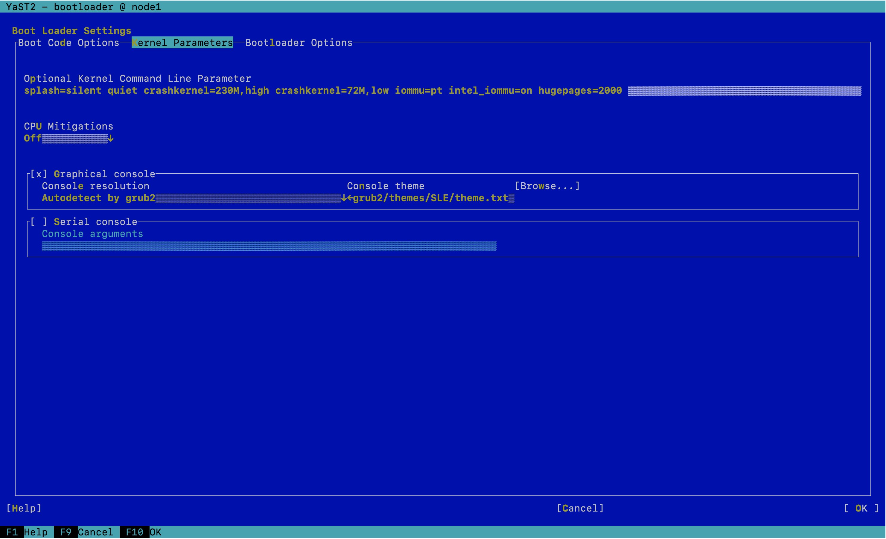
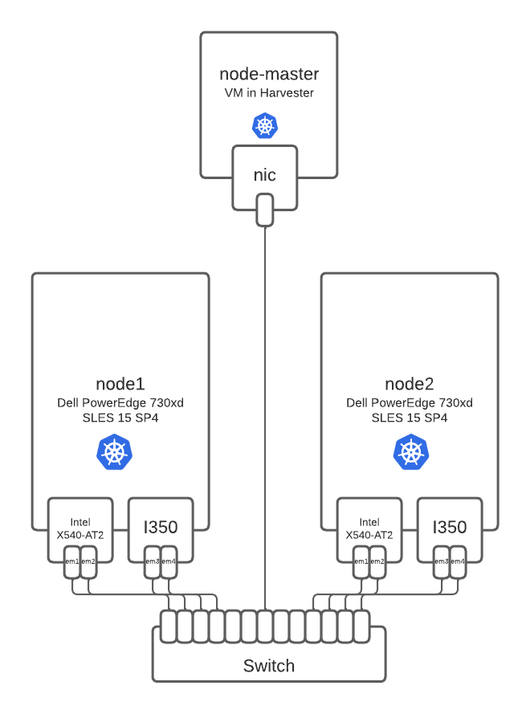
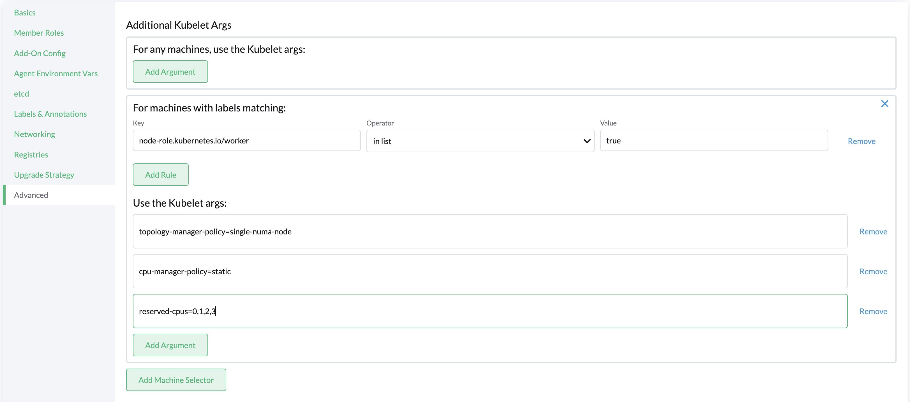

# EPA features Rancher

This tests were done with Rancher 2.6.6 + SLES 15 SP4

You will need modify the grub kernel parameters, adding this: iommu=pt intel_iommu=on hugepages=2000

To demostrate SR-IOV capapabilities and CPU-Pining/NUMA.

- My setup was a rke2 cluster with multus and canal cni:
     - node-master: 1 VM with all the roles (etcd, master, worker)
     - node1 and node2: baremetal nodes with Intel Ethernet 10-Gigabit X540-AT2

if your hostnames are the same as above you could reuse all the yamls (node-master, node1, node2).

You need to add the following args to your kubelet:

node-role.kubernetes.io/worker in list true

topology-manager-policy=single-numa-node

cpu-manager-policy=static

