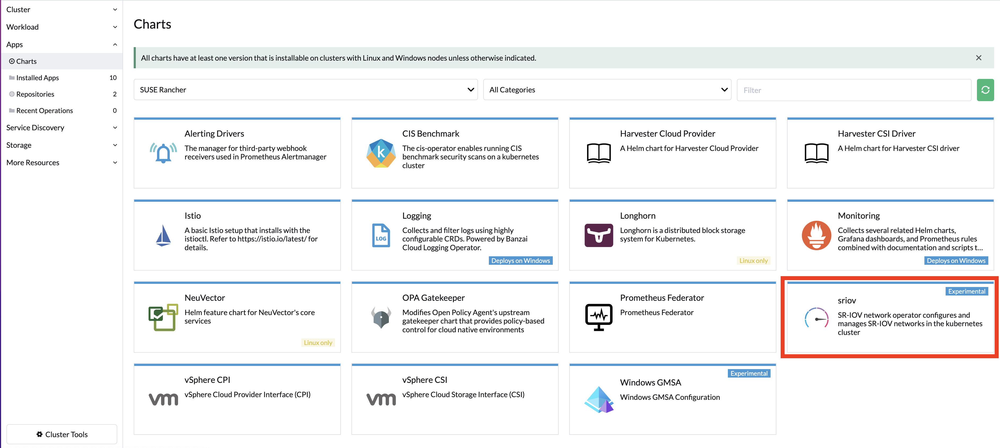

# SR-IOV Setup

Provision an RKE2 cluster with multus and canal.

## Check cards:
```
node2:~ # lshw -c network -businfo
Bus info          Device      Class          Description
========================================================
pci@0000:01:00.0  em1         network        Ethernet Controller 10-Gigabit X540-AT2
pci@0000:01:00.1  em2         network        Ethernet Controller 10-Gigabit X540-AT2
pci@0000:06:00.0  em3         network        I350 Gigabit Network Connection
pci@0000:06:00.1  em4         network        I350 Gigabit Network Connection
node2:~ #
```
### Check which cards are SR-IOV Capable

```
node2:~ # lspci -vs 0000:01:00.0
01:00.0 Ethernet controller: Intel Corporation Ethernet Controller 10-Gigabit X540-AT2 (rev 03)
	Subsystem: Dell Ethernet 10G 4P X540/I350 rNDC
	Flags: bus master, fast devsel, latency 0, IRQ 53, NUMA node 0
	Memory at 91c00000 (64-bit, prefetchable) [size=2M]
	Memory at 91e04000 (64-bit, prefetchable) [size=16K]
	Expansion ROM at 92400000 [disabled] [size=512K]
	Capabilities: [40] Power Management version 3
	Capabilities: [50] MSI: Enable- Count=1/1 Maskable+ 64bit+
	Capabilities: [70] MSI-X: Enable+ Count=64 Masked-
	Capabilities: [a0] Express Endpoint, MSI 00
	Capabilities: [e0] Vital Product Data
	Capabilities: [100] Advanced Error Reporting
	Capabilities: [150] Alternative Routing-ID Interpretation (ARI)
	Capabilities: [160] Single Root I/O Virtualization (SR-IOV)
	Capabilities: [1d0] Access Control Services
	Kernel driver in use: ixgbe
	Kernel modules: ixgbe

node2:~ #
``` 

## There are 2 ways of discovering the hardware: Auto Discovery or Manual

### Auto discovery with nfd

```
kubectl apply -k https://github.com/kubernetes-sigs/node-feature-discovery/deployment/overlays/default?ref=v0.11.2
```
Check if the capable nodes were labeled:

```
kubectl get node node1 -o json | grep feature.node.kubernetes.io/network-sriov.capable
```
You should see somthing like this as output:
```
            "feature.node.kubernetes.io/network-sriov.capable": "true"
```

### Manual

```
kubectl label node $node_name feature.node.kubernetes.io/network-sriov.capable=true
```

## Install SR-IOV chart 

Install the SR-IOV chart from the App menu in the cluster explorer in rancher



Check that the crds are present
```
kubectl get crd | grep openshift
```
Your output should look like this:
```
sriovibnetworks.sriovnetwork.openshift.io            2022-04-22T09:37:55Z
sriovnetworknodepolicies.sriovnetwork.openshift.io   2022-04-22T09:37:55Z
sriovnetworknodestates.sriovnetwork.openshift.io     2022-04-22T09:37:55Z
sriovnetworkpoolconfigs.sriovnetwork.openshift.io    2022-04-22T09:37:55Z
sriovnetworks.sriovnetwork.openshift.io              2022-04-22T09:37:55Z
sriovoperatorconfigs.sriovnetwork.openshift.io       2022-04-22T09:37:55Z
```
to check if the VFs are there do:
```
kubectl get sriovnetworknodestates.sriovnetwork.openshift.io -A
```

for creating 4 VFs in node1 do:
```
kubectl apply -f node1-policy.yaml
```

for creating 4 VFs in node2 do:
```
kubectl apply -f node2-policy.yaml
```

# IMPORTANT! The namespace of the manifest must be the same where sriov-network-config-daemon and the sriov deployment are running

You should now see on your nodes your 4 VFs created on the selected interface
```
ip link show em1
```
Your output should be similar to this:
```
node1:~ # ip link show em1
4: em1: <BROADCAST,MULTICAST,UP,LOWER_UP> mtu 1500 qdisc mq state UP mode DEFAULT group default qlen 1000
    link/ether 24:6e:96:cd:15:18 brd ff:ff:ff:ff:ff:ff
    vf 0     link/ether 92:9e:4a:62:b3:8b brd ff:ff:ff:ff:ff:ff, spoof checking on, link-state auto, trust off, query_rss off
    vf 1     link/ether d2:5d:82:2e:94:c3 brd ff:ff:ff:ff:ff:ff, spoof checking on, link-state auto, trust off, query_rss off
    vf 2     link/ether 1e:8f:7f:86:7e:e1 brd ff:ff:ff:ff:ff:ff, spoof checking on, link-state auto, trust off, query_rss off
    vf 3     link/ether b6:58:af:5d:b7:cf brd ff:ff:ff:ff:ff:ff, spoof checking on, link-state auto, trust off, query_rss off
    altname eno1
    altname enp1s0f0
node1:~ #
```

The node should have now a new allocatable resource called rancher.io/intelnics. In my case:
```
kubectl get node node1 -o jsonpath='{.status.allocatable}' | jq
```
Your output should be similar to this:
```
{
  "cpu": "32",
  "ephemeral-storage": "758911735828",
  "hugepages-1Gi": "0",
  "hugepages-2Mi": "4000Mi",
  "memory": "259480852Ki",
  "pods": "110",
  "rancher.io/intelnics": "4"
}
```

Now it is time to create the network that includes the previous resources. This will end up creating a net-attach resource for multus. For example:
```
kubectl apply -f networks.yaml
```

Again, the namespace must be the same as the previous ones. If it worked, we should see:
```
kubectl get network-attachment-definitions.k8s.cni.cncf.io -A
```
Your output should be something like this:
```
NAMESPACE     NAME              AGE
kube-system   example-network   11s
```

## You are ready to test your SR-IOV network

Deploy 2 test pods:
```
kubectl apply -f multitool.yaml
```

and the open a shell to both pods in that deployment, they should be on different nodes,

In my case pod on node 1 has ips: 10.42.11.11 and 192.168.0.15 and on node2 10.42.12.7 and 192.168.0.14

To find the IPs you can look on the annotations, or just do a clasical "ip a"

On node2 I ping'ed node1 to compare the latency between sr-iov and normal cni. Remmeber the sr-iov net is 192.168.0.0.

```
bash-5.1# ping 192.168.0.15
PING 192.168.0.15 (192.168.0.15) 56(84) bytes of data.
64 bytes from 192.168.0.15: icmp_seq=1 ttl=64 time=0.155 ms
64 bytes from 192.168.0.15: icmp_seq=2 ttl=64 time=0.071 ms
64 bytes from 192.168.0.15: icmp_seq=3 ttl=64 time=0.086 ms
64 bytes from 192.168.0.15: icmp_seq=4 ttl=64 time=0.079 ms
64 bytes from 192.168.0.15: icmp_seq=5 ttl=64 time=0.084 ms
64 bytes from 192.168.0.15: icmp_seq=6 ttl=64 time=0.064 ms
64 bytes from 192.168.0.15: icmp_seq=7 ttl=64 time=0.091 ms
64 bytes from 192.168.0.15: icmp_seq=8 ttl=64 time=0.073 ms
64 bytes from 192.168.0.15: icmp_seq=9 ttl=64 time=0.081 ms
64 bytes from 192.168.0.15: icmp_seq=10 ttl=64 time=0.062 ms
64 bytes from 192.168.0.15: icmp_seq=11 ttl=64 time=0.085 ms
64 bytes from 192.168.0.15: icmp_seq=12 ttl=64 time=0.072 ms
64 bytes from 192.168.0.15: icmp_seq=13 ttl=64 time=0.092 ms
64 bytes from 192.168.0.15: icmp_seq=14 ttl=64 time=0.076 ms
^C
--- 192.168.0.15 ping statistics ---
14 packets transmitted, 14 received, 0% packet loss, time 13296ms
rtt min/avg/max/mdev = 0.062/0.083/0.155/0.021 ms
bash-5.1# ping 10.42.11.11
PING 10.42.11.11 (10.42.11.11) 56(84) bytes of data.
64 bytes from 10.42.11.11: icmp_seq=1 ttl=62 time=0.334 ms
64 bytes from 10.42.11.11: icmp_seq=2 ttl=62 time=0.180 ms
64 bytes from 10.42.11.11: icmp_seq=3 ttl=62 time=0.187 ms
64 bytes from 10.42.11.11: icmp_seq=4 ttl=62 time=0.164 ms
64 bytes from 10.42.11.11: icmp_seq=5 ttl=62 time=0.192 ms
64 bytes from 10.42.11.11: icmp_seq=6 ttl=62 time=0.200 ms
64 bytes from 10.42.11.11: icmp_seq=7 ttl=62 time=0.182 ms
64 bytes from 10.42.11.11: icmp_seq=8 ttl=62 time=0.149 ms
64 bytes from 10.42.11.11: icmp_seq=9 ttl=62 time=0.177 ms
64 bytes from 10.42.11.11: icmp_seq=10 ttl=62 time=0.183 ms
64 bytes from 10.42.11.11: icmp_seq=11 ttl=62 time=0.180 ms
64 bytes from 10.42.11.11: icmp_seq=12 ttl=62 time=0.179 ms
64 bytes from 10.42.11.11: icmp_seq=13 ttl=62 time=0.205 ms
64 bytes from 10.42.11.11: icmp_seq=14 ttl=62 time=0.203 ms
64 bytes from 10.42.11.11: icmp_seq=15 ttl=62 time=0.178 ms
64 bytes from 10.42.11.11: icmp_seq=16 ttl=62 time=0.201 ms
64 bytes from 10.42.11.11: icmp_seq=17 ttl=62 time=0.160 ms
64 bytes from 10.42.11.11: icmp_seq=18 ttl=62 time=0.203 ms
64 bytes from 10.42.11.11: icmp_seq=19 ttl=62 time=0.166 ms
^C
--- 10.42.11.11 ping statistics ---
19 packets transmitted, 19 received, 0% packet loss, time 18422ms
```

Now lets test traffic with iperf3, start a server on node2,

```
bash-5.1# iperf3 -s 
-----------------------------------------------------------
Server listening on 5201
-----------------------------------------------------------
```

Now go to node1 and start a client,

```
bash-5.1# iperf3 -c 192.168.0.14
Connecting to host 192.168.0.14, port 5201
[  5] local 192.168.0.15 port 33874 connected to 192.168.0.14 port 5201
[ ID] Interval           Transfer     Bitrate         Retr  Cwnd
[  5]   0.00-1.00   sec  1.10 GBytes  9.44 Gbits/sec    7    735 KBytes       
[  5]   1.00-2.00   sec  1.09 GBytes  9.40 Gbits/sec   33   1.31 MBytes       
[  5]   2.00-3.00   sec  1.09 GBytes  9.35 Gbits/sec  110    963 KBytes       
[  5]   3.00-4.00   sec  1.10 GBytes  9.42 Gbits/sec   11    830 KBytes       
[  5]   4.00-5.00   sec  1.09 GBytes  9.41 Gbits/sec   40   1.18 MBytes       
[  5]   5.00-6.00   sec  1.10 GBytes  9.42 Gbits/sec   28   1.05 MBytes       
[  5]   6.00-7.00   sec  1.10 GBytes  9.42 Gbits/sec   59   1.12 MBytes       
[  5]   7.00-8.00   sec  1.09 GBytes  9.38 Gbits/sec   60    889 KBytes       
[  5]   8.00-9.00   sec  1.09 GBytes  9.41 Gbits/sec  345   1.17 MBytes       
[  5]   9.00-10.00  sec  1.10 GBytes  9.42 Gbits/sec    0   1.38 MBytes       
- - - - - - - - - - - - - - - - - - - - - - - - -
[ ID] Interval           Transfer     Bitrate         Retr
[  5]   0.00-10.00  sec  10.9 GBytes  9.40 Gbits/sec  693             sender
[  5]   0.00-10.00  sec  10.9 GBytes  9.40 Gbits/sec                  receiver

iperf Done.
bash-5.1# iperf3 -c 10.42.12.7
Connecting to host 10.42.12.7, port 5201
[  5] local 10.42.11.11 port 49086 connected to 10.42.12.7 port 5201
[ ID] Interval           Transfer     Bitrate         Retr  Cwnd
[  5]   0.00-1.00   sec   738 MBytes  6.19 Gbits/sec  1019    745 KBytes       
[  5]   1.00-2.00   sec   671 MBytes  5.63 Gbits/sec   47    822 KBytes       
[  5]   2.00-3.00   sec   711 MBytes  5.96 Gbits/sec   22    917 KBytes       
[  5]   3.00-4.00   sec   882 MBytes  7.41 Gbits/sec   38    814 KBytes       
[  5]   4.00-5.00   sec   676 MBytes  5.67 Gbits/sec   40    831 KBytes       
[  5]   5.00-6.00   sec   586 MBytes  4.92 Gbits/sec   16    874 KBytes       
[  5]   6.00-7.00   sec   659 MBytes  5.53 Gbits/sec   33    748 KBytes       
[  5]   7.00-8.00   sec   618 MBytes  5.18 Gbits/sec   11    807 KBytes       
[  5]   8.00-9.00   sec   651 MBytes  5.46 Gbits/sec   18    774 KBytes       
[  5]   9.00-10.00  sec   714 MBytes  5.99 Gbits/sec   32    928 KBytes       
- - - - - - - - - - - - - - - - - - - - - - - - -
[ ID] Interval           Transfer     Bitrate         Retr
[  5]   0.00-10.00  sec  6.75 GBytes  5.79 Gbits/sec  1276             sender
[  5]   0.00-10.00  sec  6.74 GBytes  5.79 Gbits/sec                  receiver

iperf Done.
bash-5.1# 
```
