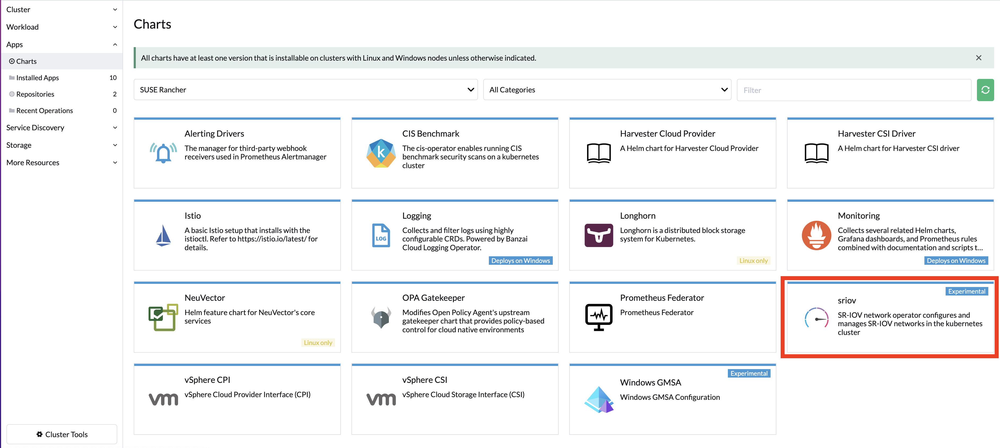

# SR-IOV Setup

Provision an RKE2 cluster with multus and canal.

## Check cards:
```
node2:~ # lshw -c network -businfo
Bus info          Device      Class          Description
========================================================
pci@0000:01:00.0  em1         network        Ethernet Controller 10-Gigabit X540-AT2
pci@0000:01:00.1  em2         network        Ethernet Controller 10-Gigabit X540-AT2
pci@0000:06:00.0  em3         network        I350 Gigabit Network Connection
pci@0000:06:00.1  em4         network        I350 Gigabit Network Connection
node2:~ #
```
### Check which cards are SR-IOV Capable

```
node2:~ # lspci -vs 0000:01:00.0
01:00.0 Ethernet controller: Intel Corporation Ethernet Controller 10-Gigabit X540-AT2 (rev 03)
	Subsystem: Dell Ethernet 10G 4P X540/I350 rNDC
	Flags: bus master, fast devsel, latency 0, IRQ 53, NUMA node 0
	Memory at 91c00000 (64-bit, prefetchable) [size=2M]
	Memory at 91e04000 (64-bit, prefetchable) [size=16K]
	Expansion ROM at 92400000 [disabled] [size=512K]
	Capabilities: [40] Power Management version 3
	Capabilities: [50] MSI: Enable- Count=1/1 Maskable+ 64bit+
	Capabilities: [70] MSI-X: Enable+ Count=64 Masked-
	Capabilities: [a0] Express Endpoint, MSI 00
	Capabilities: [e0] Vital Product Data
	Capabilities: [100] Advanced Error Reporting
	Capabilities: [150] Alternative Routing-ID Interpretation (ARI)
	Capabilities: [160] Single Root I/O Virtualization (SR-IOV)
	Capabilities: [1d0] Access Control Services
	Kernel driver in use: ixgbe
	Kernel modules: ixgbe

node2:~ #
``` 

## There are 2 ways of discovering the hardware: Auto Discovery or Manual

### Auto discovery with nfd

```
kubectl apply -k https://github.com/kubernetes-sigs/node-feature-discovery/deployment/overlays/default?ref=v0.11.2
```
Check if the capable nodes were labeled:

```
kubectl get node node1 -o json | grep feature.node.kubernetes.io/network-sriov.capable
            "feature.node.kubernetes.io/network-sriov.capable": "true"
```

### Manual

```
kubectl label node $node_name feature.node.kubernetes.io/network-sriov.capable=true
```

## Install SR-IOV chart 

Install the SR-IOV chart from the App menu in the cluster explorer in rancher




